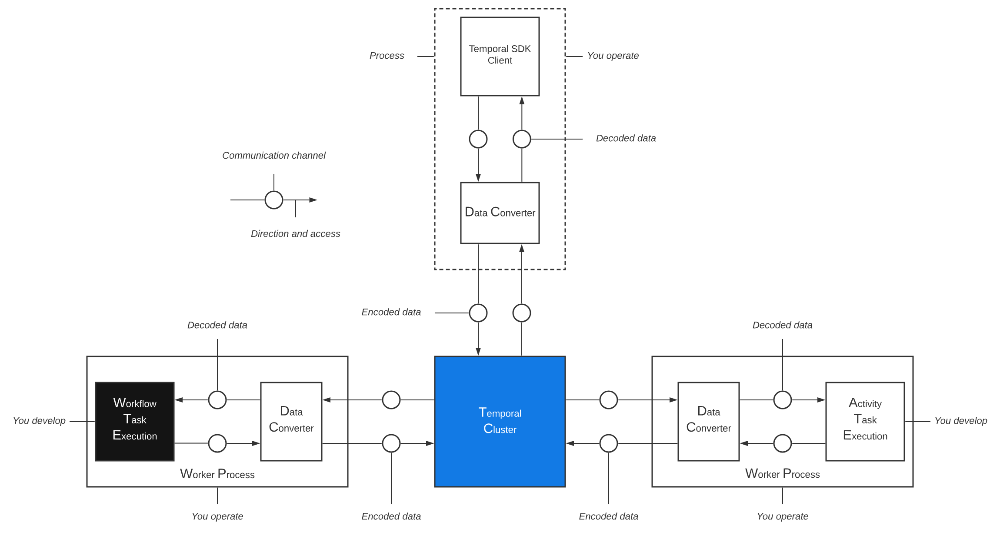

# Henry's Personal Notes

> Personal scratchpad. Do not edit without explicit permission.

## Active Work

### In progress
_(nothing right now)_

### Next up
_(pull from backlog when ready)_

### Backlog

**Apply inspiration-mining findings** — patterns from [docs/dev_docs/inspiration-notes.md](docs/dev_docs/inspiration-notes.md)
- [ ] Lesson 08 (long-running) — dual-heartbeat + checkpoint coordination from langgraph-checkpoint-recovery (separate from the continue-as-new add)
- [ ] Lesson 09 (Logfire observability) — pair Logfire traces with `@workflow.query` as the in-cluster observability channel
- [ ] Capstones (10, 11) — show `continue_as_new` weaving into a real multi-agent loop; mention the adapter pattern as a Track-03 escape hatch for non-Pydantic-AI agent frameworks
- [x] ~~Lesson 07 — add `@workflow.query`~~ (done 2026-05-25; see commit)
- [x] ~~Lesson 08 — promote `continue_as_new` from "out of scope" to demonstrated~~ (done 2026-05-25; see commit)

**Concept docs (deferred)**
- [ ] Temporal Nexus explainer
- [ ] Temporal server UI tour

### Done
- [x] 2026-05-25 — Track 01 lesson READMEs (02–12) rewritten to symbol-anchored prose + verbatim snippets per dev guide rule 3.2; lesson 10 tests still pass
- [x] 2026-05-25 — Drafted [Temporal server + workflow requirements](docs/temporal/workflow-requirements.md) explainer (the four collaborators, minimum workflow, determinism contract, activity contract, pre-flight checklist)
- [x] 2026-05-25 — Applied 2 inspiration findings: lesson 07 now teaches signals **and** queries side-by-side (ralph-wiggum pattern); lesson 08 now actually demonstrates `continue_as_new` instead of linking out
- [x] 2026-05-25 — Mined steveandroulakis repos; findings in [docs/dev_docs/inspiration-notes.md](docs/dev_docs/inspiration-notes.md) — actionable hooks into lessons 05, 07, 08, 09 and the capstones
- [x] 2026-05-25 — Codified lesson file decomposition standard as [dev guide rule 3.6](docs/dev_docs/LESSON-DEVELOPMENT-GUIDE.md#36-file-decomposition--split-only-when-something-forces-it); slimmed CLAUDE.md pointer
- [x] 2026-05-25 — Drafted [`pai` REPL quickstart](docs/pai-quickstart.md)
- [x] 2026-05-25 — Removed broken `make test-all`; renamed asset to `temporal-data-converter-arch.png`; codec server doc now uses Henry's dedicated SVG
- [x] 2026-05-25 — Co-located track 1 lessons into `lessons/NN_<slug>/` dirs (mirrors track 2); moved `runtimes.md` to `docs/`; YAMLs into the lesson dirs that own them
- [x] 2026-05-25 — Drafted Temporal codec server explainer ([docs/temporal/codec-server.md](docs/temporal/codec-server.md))
- [x] 2026-05-25 — Renamed `tracks/02-temporal/examples/` → `lessons/`; Makefile, tests, READMEs, dev guide all updated
- [x] 2026-05-25 — Decided: keep `learn_pydantic_ai/` package name (Python convention > shorter)
- [x] 2026-05-25 — Reorganized this file (NOTES.md) by purpose
- [x] 2026-05-24 — Standardized AI-gen doc naming + frontmatter ([docs/dev_docs/ai_gen/README.md](docs/dev_docs/ai_gen/README.md) sets the convention)

---

## Open Questions

Promote answered questions into a lesson or doc, then move the entry to **Resolved** below with a pointer.

### Pydantic AI
_(none right now)_

### Temporal
- [ ] Are there restrictions on the return types of activities?
- [ ] Can a single Temporal server handle activities across multiple SDK languages (Python + Go + TS workers in one cluster)?
- [ ] What communication protocols does a Temporal server use to talk to worker processes?
- [ ] Does a Temporal server work with any worker bound via configuration, or is there a tighter pairing?

### Pydantic AI × Temporal
- [ ] How do we implement agent middleware (pydantic-ai or otherwise) under Temporal?

### Resolved
_(empty — link to the lesson/doc that answered it when you move entries here)_

---

## Document Stubs

Drafts to expand later. Promote to [docs/](docs/) once they have substance.

### Temporal codec server
- What it is, why it exists (encryption/redaction of payloads in the Temporal UI)
- Architecture reference:  (worker/client-side encoding — the codec server sits adjacent)
- Minimum setup
- When to use it vs. when not to

### Temporal Nexus
- What it is, what problem it solves
- vs. cross-namespace workflow calls
- Worked example

### Temporal server UI tour
Pages to cover: Workflows · Schedules · Batch · Deployments · Archive · Namespaces

---

## Resources

### Official
- [Pydantic AI docs](https://ai.pydantic.dev/)

### Inspiration repos
- [steveandroulakis/temporal-ralph-wiggum](https://github.com/steveandroulakis/temporal-ralph-wiggum)
- [steveandroulakis/temporal-langgraph-checkpoint-recovery](https://github.com/steveandroulakis/temporal-langgraph-checkpoint-recovery)

### Architecture diagrams
-  — accompanies [docs/temporal/codec-server.md](docs/temporal/codec-server.md)

---

## Lesson Notes — As Learner

Capture aha-moments and confusions while working through lessons. Promote questions to [Open Questions](#open-questions); promote pedagogical observations to [As Designer](#lesson-notes--as-designer).

### Track 01 — Intro
_(empty)_

### Track 02 — Temporal

**Lesson 01** — see [Open Questions → Temporal](#temporal)

---

## Lesson Notes — As Designer

Capture pedagogical observations: what works, what doesn't, what's missing, what to teach next.

_(empty)_
