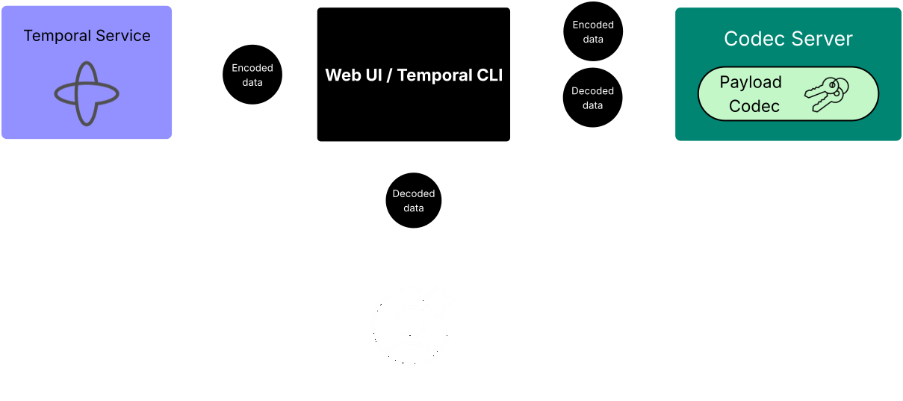

# Temporal codec server

A codec server is **a small HTTP service you run that the Temporal Web UI and `temporal` CLI call to decode workflow payloads on demand**. Without it, anything you encrypted or compressed in your workers shows up in the UI as opaque base64 blobs you can't read.

> **TL;DR** — Your workers encode payloads with a Data Converter; the Temporal Cluster only ever sees those encoded bytes. The codec server is a separate HTTP endpoint that the UI/CLI hit to *decode* those bytes when a human wants to inspect them. The cluster never sees plaintext, and your codec server runs in your trust boundary.

## Where it sits



- The **Temporal Cluster** only ever stores and forwards *encoded* bytes.
- Your **Worker processes** use a Data Converter to encode outbound payloads and decode inbound ones — this is the execution path. See the [Data Converter diagram](../../assets/temporal-data-converter-arch.png) for the worker side.
- The **Codec Server** is a separate HTTP service *you* operate, sitting next to the Web UI / CLI. It exposes the same codec logic over HTTP so humans can decode payloads they're viewing.

When a human opens a workflow in the UI, the UI calls `/decode` on your codec server with the encoded bytes from the cluster and gets back something human-readable. The cluster never sees the decoded form.

## Why you'd run one

The two practical use cases:

1. **Payload encryption** — sensitive data (PII, secrets, prompt content) must never sit in plaintext on the Temporal cluster. Workers encrypt with a `PayloadCodec`; humans need the codec server to read the history later.
2. **Large payloads in external storage** — when payloads exceed Temporal's size limits, workers store the body in S3/GCS and pass a pointer. The codec server's `/download` endpoint fetches and returns the real content for the UI.

If you're not encrypting and not offloading large payloads, **you don't need a codec server.** The default JSON converter renders fine in the UI.

## API contract

A codec server exposes three POST endpoints. All accept and return JSON with base64-encoded payload bodies.

| Endpoint    | Purpose                                           |
| ----------- | ------------------------------------------------- |
| `/encode`   | Encrypt/compress payloads (rarely needed by UI)   |
| `/decode`   | Decrypt/decompress payloads for display           |
| `/download` | Fetch externally-stored payloads (S3, GCS, etc.)  |

Requests carry an `X-Namespace` header identifying the target namespace. The codec server is free to vary key material or behavior per namespace.

## Wiring it up

### Temporal CLI

```bash
# Global default
temporal env set --codec-endpoint "http://localhost:8888"

# Per-command override
temporal workflow show -w my-workflow-id \
  --codec-endpoint http://localhost:8888 \
  --codec-auth "Bearer $TOKEN"
```

### Web UI

In the Temporal Web UI: **Namespaces → \<your namespace\> → Codec Server** and paste the endpoint URL. You can additionally:
- Enable JWT passthrough so the UI forwards the operator's access token to your codec server
- Include cross-origin credentials for cookie-based auth
- Override the endpoint per-browser-session for testing

## Security notes

| Concern               | What to do                                                                                             |
| --------------------- | ------------------------------------------------------------------------------------------------------ |
| **HTTPS**             | Required if the UI is going to send Authorization headers — browsers block credentialed cross-origin requests over HTTP. |
| **Network isolation** | Restrict ingress (VPN/firewall). A localhost-only codec server is a valid pattern for ops workstations. |
| **CORS**              | Allow the UI's origin and the `X-Namespace` + `Authorization` headers in your CORS policy.             |
| **Auth on the server**| For Temporal Cloud, validate the forwarded JWT against the published JWKS. Self-hosted: whatever fits your IAM. |
| **Key custody**       | Your workers and codec server need the same decryption keys. Use a KMS — don't ship keys in code.      |

## What the cluster does and doesn't see

Decoded payloads exist **only** on the client side — your workers, your SDK clients, and the codec server's response to the UI. The Temporal Service stores and replays the encoded form. This is the property that lets sensitive workflows run on managed/multi-tenant Temporal deployments.

## Costs and gotchas

- **Latency**: every payload field rendered in the UI triggers a request. The UI fans out multiple `/decode` calls per workflow view; slow codec servers make the UI feel slow.
- **Availability**: the codec server is on the critical path for operator debugging. If it's down, history is unreadable in the UI even though workflows keep running fine.
- **Versioning**: keep the codec server's codec implementation in lockstep with what your workers ship. A worker that writes with codec v2 produces history a v1 codec server can't decode.

## When this matters in this curriculum

Track 02 lessons don't use a codec server — payloads are plain JSON, visible in the local UI at <http://localhost:8080>. You'd reach for one when productionizing an agent workflow whose inputs/outputs include user data you don't want stored at rest on the cluster.

## References

- Temporal docs: [Data encryption and Codec Server](https://docs.temporal.io/production-deployment/data-encryption)
- Temporal samples (Python): <https://github.com/temporalio/samples-python/tree/main/encryption>
